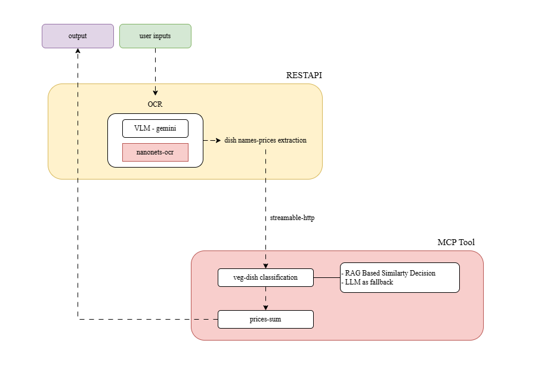

# Agentic AI Veg Menu

An intelligent system for extracting vegetarian dish names from menu images using AI agents.

## Workflow



The diagram above illustrates the complete workflow of the agentic AI system for vegetarian menu extraction.

## Features

- 🍽️ Extracts vegetarian dishes from menu images
- 🤖 Uses AI agents for classification and pricing
- 🔌 MCP (Model Context Protocol) server integration
- 🌐 REST API interface

## Prerequisites

- Python 3.8+
- HuggingFace API key
- Google Gemini API key

## Installation

### Without Docker

#### 1. Install Dependencies

```bash
pip install -r requirements.txt
```

#### 2. Configure Environment

Create a `.env` file in the root directory based on `.env.examples`:

```bash
cp .env.examples .env
```

Add your API keys to the `.env` file:
- HuggingFace API key
- Google Gemini API key

#### 3. Configure Application

Update the `config.yaml` file with your required parameters.

## Running the Application

### Start MCP Server

The MCP server handles classification and pricing operations.

```bash
python -m mcp_modules.server
```

Run this command from the root directory. The server will start and be ready to process requests.

### Start REST API

Launch the REST API server on port 9000:

```bash
uvicorn main:app --reload --port 9000
```

Run this command from the root directory. The API will be available at `http://localhost:9000`.

## Project Structure

```
agentic-ai-veg-menu/
├── mcp_modules/
    └── server.py
    └── classify_veg_dishes.py
    └── Dockerfile
    └──...
├── gemini_v0/
    └── gemini_extraction.py
    └──...
├── rag_module/
    └── knowledge_base.json
    └── knowledge_base.index
    └── save_emb.py
    └──...
├── utils/
    └── helper_functions.py
    └── load_config.py
    └── logger_setup.py
├── main.py
├── model_instances.py
├── config.yaml
├── requirements.txt
├── .env.examples
└── README.md
```

## API Usage

Once the REST API is running, you can send menu images to extract vegetarian dishes. The system will:

1. Process the uploaded menu image
2. Identify vegetarian dishes
3. Classify dishes using the MCP server
4. Calculate pricing information
5. Return structured results

## Configuration

Edit `config.yaml` to customize:
- `MAX_IMAGES`
- `mcp_url`
- `gemini_model_id`
- `main_port`
- `emb_model`
- `knowledge_based_file_name`


## Troubleshooting

- Ensure both API keys are correctly set in the `.env` file
- Verify the MCP server is running before starting the REST API
- Check that port 9000 is available for the REST API

## License


## Contributing
